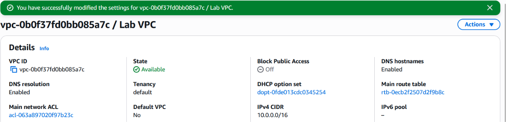
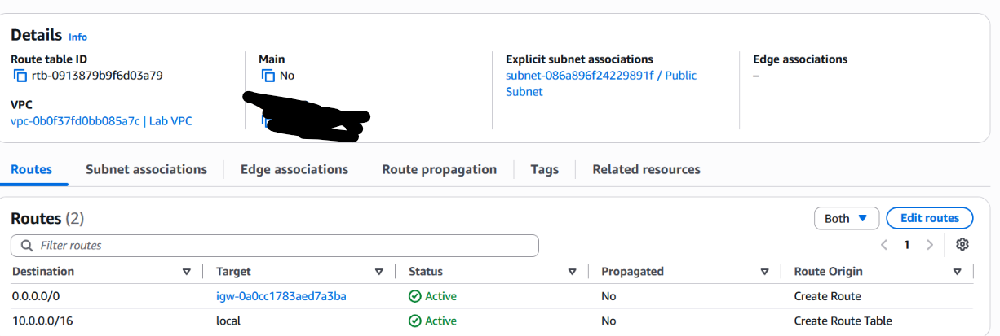
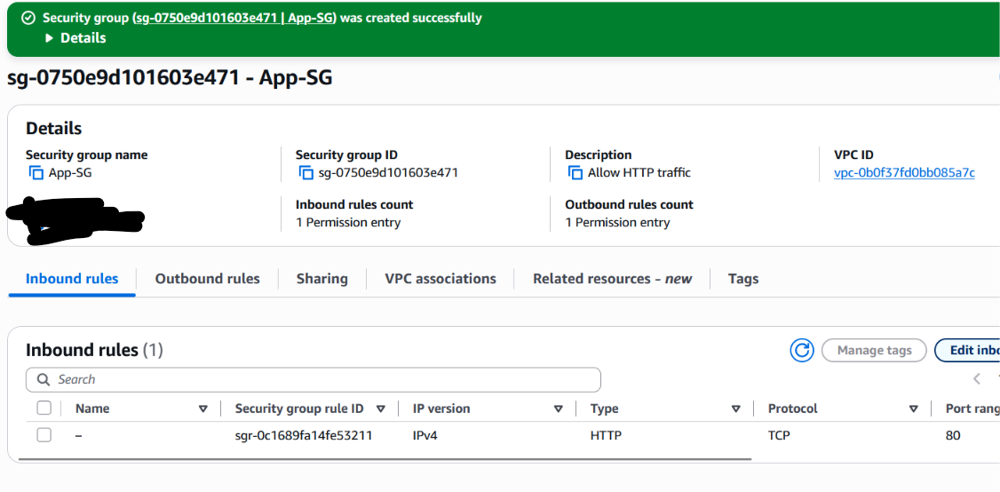

# Lab 01 – Building a VPC from Scratch

Built in my own AWS account (us-east-1) as hands-on practice for the **AWS Solutions Architect Associate (SAA-C03)** exam.

## Goal
Build a custom VPC with one public and one private subnet, connect the public subnet to the internet, and understand **exactly what makes a subnet public or private**.

## Architecture
```
Lab VPC 10.0.0.0/16  (us-east-1a)
│
├── Public Subnet   10.0.0.0/24  (251 usable IPs, auto-assign public IP: ON)
│     └── Public Route Table:  10.0.0.0/16 → local
│                              0.0.0.0/0   → Internet Gateway (Lab IGW)
│
└── Private Subnet  10.0.2.0/23  (507 usable IPs, auto-assign public IP: OFF)
      └── Private Route Table (main): 10.0.0.0/16 → local only
```

## What I built
- **VPC** `10.0.0.0/16` with DNS resolution and DNS hostnames enabled
- **Public subnet** `10.0.0.0/24` in us-east-1a, auto-assign public IPv4 turned on
- **Private subnet** `10.0.2.0/23` in us-east-1a, larger because most resources should stay private
- **Internet gateway** attached to the VPC
- **Public route table** with `0.0.0.0/0 → IGW`, associated with the public subnet only
- **Private route table** (the VPC's main route table) with only the local route
- **Security group App-SG** allowing inbound HTTP (port 80)

## Screenshots

**Custom VPC created with DNS hostnames enabled:**


**Public subnet: 10.0.0.0/24, auto-assign public IPv4 = Yes, uses the Public Route Table:**


**Private subnet: 10.0.2.0/23, 507 available IPs, auto-assign public IPv4 = No:**


**Public route table: associated with the Public Subnet, and its 0.0.0.0/0 → IGW route is what makes the subnet public:**


**Private route table (main): no explicit associations and only the local route, so the private subnet has no path to the internet:**


**App-SG allows inbound HTTP on port 80:**


## Problem I found + fix
At first I added the `0.0.0.0/0 → IGW` route to the VPC's **main** route table.
Every subnet that is not explicitly associated with another route table uses the main route table,
so my **private subnet also got a route to the internet**. It was not really private anymore.

**Before the fix:** the main route table (Main = Yes) had the IGW route and the Public Subnet association:


**Fix:**
1. Created a separate **Public Route Table** with `0.0.0.0/0 → IGW`.
2. Associated only the **Public Subnet** with it.
3. Removed the IGW route from the main route table and renamed it **Private Route Table**.

**Lesson:** never put an internet route on the main route table. New subnets use it by default,
so a mistake there can expose every new subnet.

## Key takeaways (SAA-C03)
- A subnet is public **only** if its route table sends `0.0.0.0/0` to an internet gateway.
- A subnet without an explicit association uses the VPC's **main route table**.
- AWS reserves **5 IPs per subnet**: /24 = 251 usable, /23 = 507 usable.
- A subnet lives in **one AZ**. High availability needs subnets in 2+ AZs.
- An instance needs **both** a public IP and an IGW route to reach the internet.
- Security groups are **stateful** and **allow-only**.

## Applied to my inventory app
Next I will build `inventory-vpc` for my warehouse inventory tracker with public, private-app,
and private-database subnets across **2 Availability Zones**, so the app can stay up if one AZ fails.

## Cleanup
Deleted the security group, detached and deleted the internet gateway, then deleted the subnets and the VPC to avoid charges.
